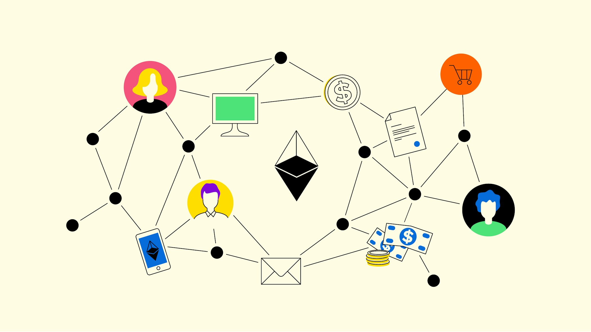
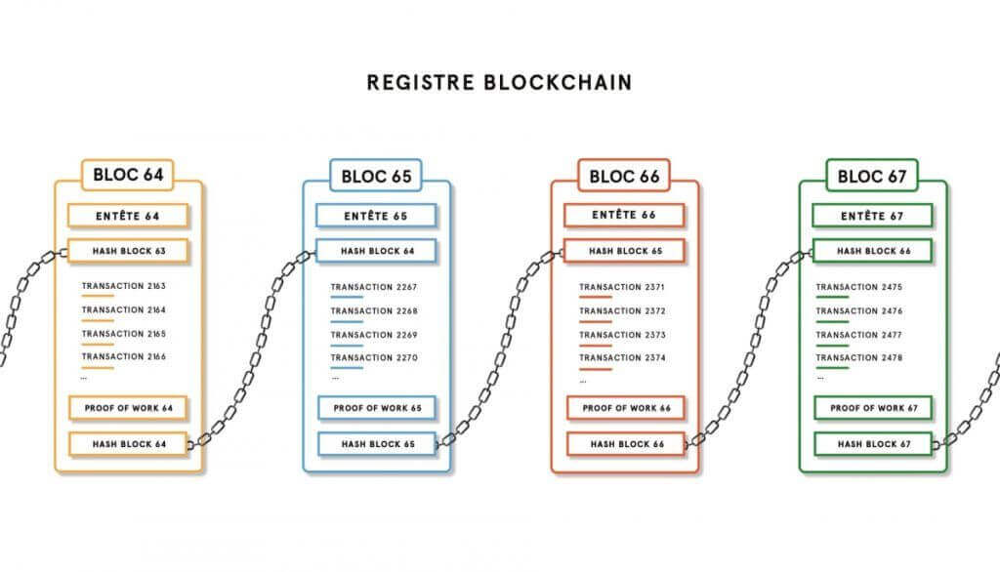
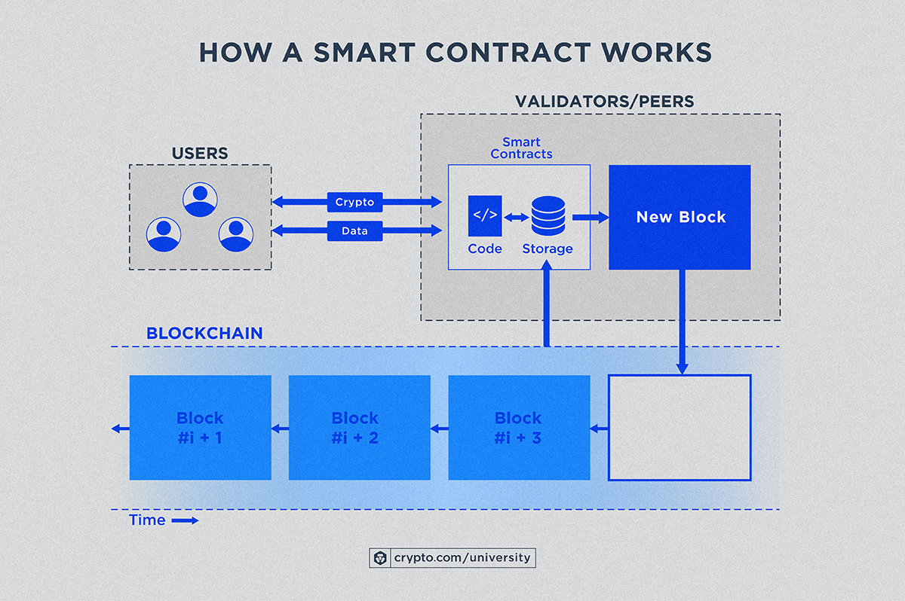

## What is a blockchain ?

A blockchain is a decentralized digital ledger that records transactions across multiple computers in a way that ensures security, transparency, and immutability. It operates as a chain of blocks, where each block contains a set of transactions, a timestamp, and a reference to the previous block through a cryptographic hash. This linking mechanism creates a secure and tamper-proof system.

When a transaction occurs, it is broadcast to a network of computers (nodes), which validate it using consensus mechanisms like Proof of Work (PoW) or Proof of Stake (PoS). Once verified, transactions are grouped into a block, which is then added to the existing blockchain in chronological order. Since each block references the previous one, altering any past transaction would require modifying all subsequent blocks, making it computationally infeasible and ensuring data integrity.

## Difference between coins and tokens

The main difference between a coin and a token lies in their purpose and the blockchain they operate on. A coin typically refers to a digital asset that has its own native blockchain, like Bitcoin or Ethereum. It is primarily used as a currency or store of value within its respective blockchain ecosystem. A token, on the other hand, is a digital asset that exists on an existing blockchain, such as Ethereum, and can represent various things like assets, services, or even voting rights. Tokens are usually created using smart contracts on a platform like Ethereum, allowing for more flexibility in their use cases beyond just serving as a currency. Coins are generally used for transactions or as a medium of exchange, while tokens can represent anything from utility within a specific project to ownership or rights in decentralized applications.

## What is a smart contract?

A smart contract is a self-executing contract with the terms of the agreement directly written into lines of code. It runs on a blockchain, typically Ethereum, and automatically enforces and executes the contract's terms when predefined conditions are met. Once deployed on the blockchain, smart contracts are immutable, meaning they can't be changed, which ensures transparency and trust.

For example, in a real estate transaction, a smart contract could automatically transfer ownership of a property once the buyer’s payment is verified. The contract would include conditions such as the price, payment methods, and deadlines, and once those conditions are met, it triggers the actions (like transferring the deed to the new owner).

Smart contracts are used in various applications, including decentralized finance (DeFi), supply chain management, and voting systems, because they eliminate intermediaries and reduce the potential for fraud.

## What is an ERC-20 token?

An ERC-20 token is a type of token standard used on the Ethereum blockchain. "ERC" stands for Ethereum Request for Comments, and "20" is the unique proposal number for this standard. ERC-20 defines a set of rules that all tokens on the Ethereum network must follow, ensuring that they are interoperable with each other and with Ethereum-based applications like wallets, exchanges, and smart contracts.

The ERC-20 standard specifies how tokens should behave, including how they are transferred, how transactions are approved, and how users can access the balance of tokens. Some of the key functions it defines include:

- Transfer: Allows the transfer of tokens from one address to another.
- BalanceOf: Allows checking the balance of tokens for a specific address.
- Approve and Allowance: Allows users to approve a third party (like a smart contract) to spend a certain amount of their tokens.
- TotalSupply: Indicates the total supply of the token.

## Technical resources

- https://solidity-by-example.org/hello-world/
- https://www.youtube.com/watch?v=AYpftDFiIgk

