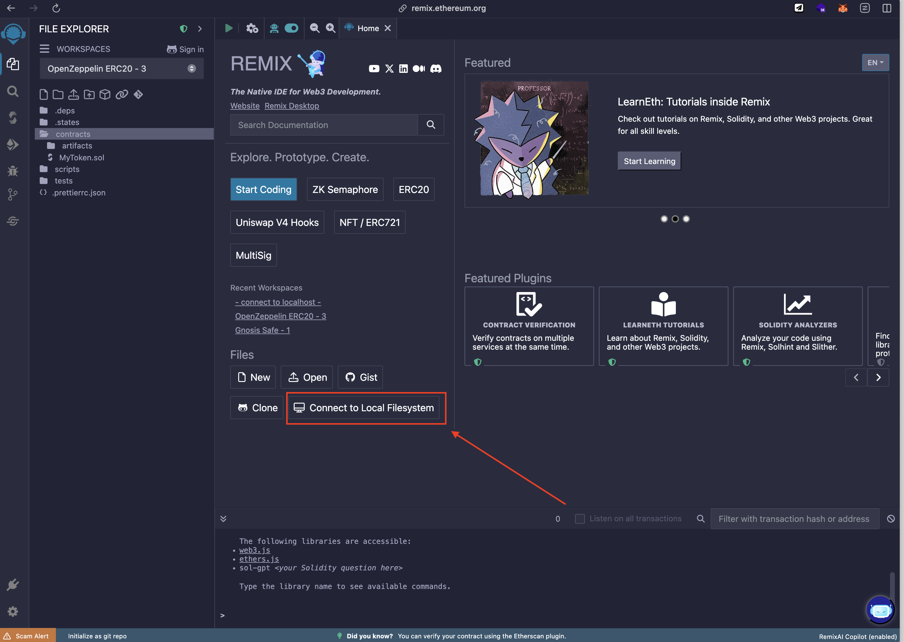
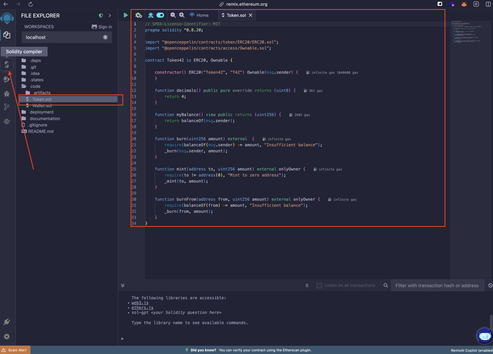
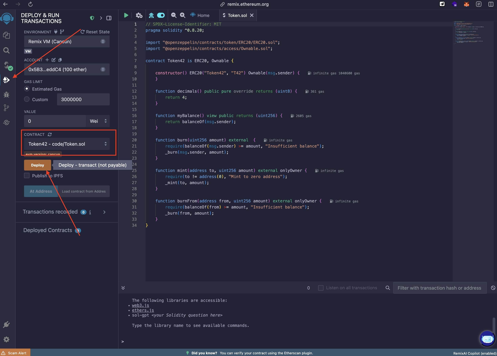
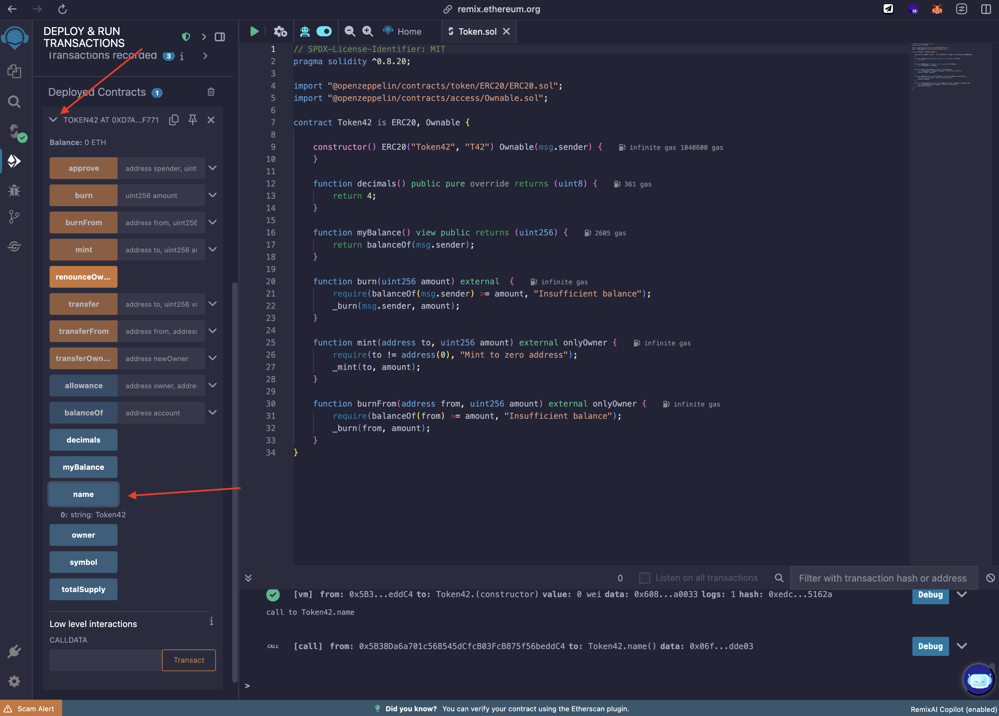

# Deployment

We'll use Remix IDE, the most popular web-based development environment for Ethereum smart contracts. Remix provides everything you need in your browser:

- A Solidity code editor with syntax highlighting
- Built-in compiler with version management
- Deployment tools for testnets and mainnet
- Debugging and testing capabilities


## Prerequisites

- Node.js and npm installed on your machine
- Web browser (Chrome, Firefox, or Safari)
- Metamask wallet if you want to deploy on a testnet or mainnet (optional)

## Installation

Let's synchronize the Remix IDE with our local environment. This will allow us to work on our smart contracts directly from our local machine.

Go to the `deployment/` folder in your terminal and run the following command:

```shell
npm i && open "https://remix.ethereum.org" && ./remix_sync.sh ../
```

Once the command is executed, it will open the Remix IDE in your default web browser, and you can click on `Connect to Local Filesystem` to open the current project folder in Remix.



## Compile and Deploy

1. Open the Remix IDE in your web browser (or use the command above).
2. Go to `code/` folder in the Remix file explorer and select a smart contract file (e.g., `Token.sol`).
3. Click on the "Solidity Compiler" tab in the left sidebar.



4. Compile the contract by clicking the "Compile" button. Make sure there are no errors in the code.
5. Go to the "Deploy & Run Transactions" tab in the left sidebar.
6. Select the environment (Remix VM, Injected Web3, or Web3 Provider) based on your deployment preference.
7. Select the contract you want to deploy from the dropdown menu.
8. Click the "Deploy" button to deploy the contract.



9. Once deployed, you will see the contract address and other details in the Remix console.
10. You can interact with the deployed contract using the Remix interface, calling functions and sending transactions as needed.


